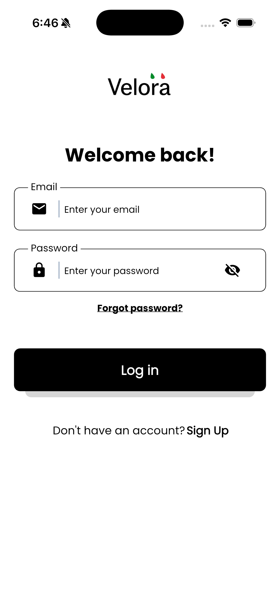
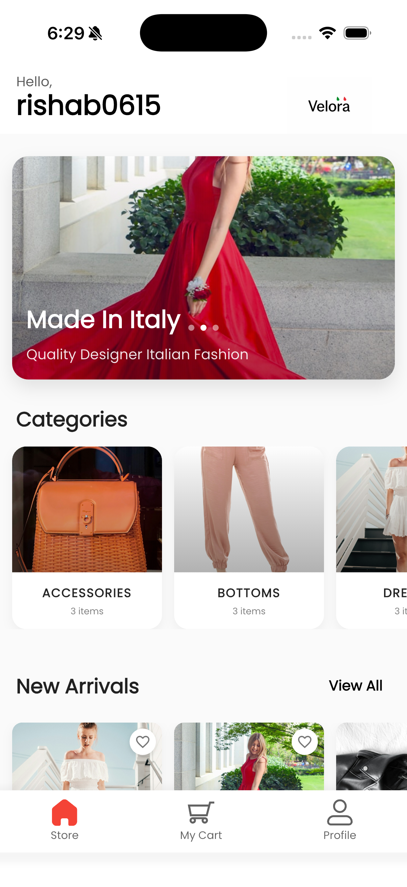
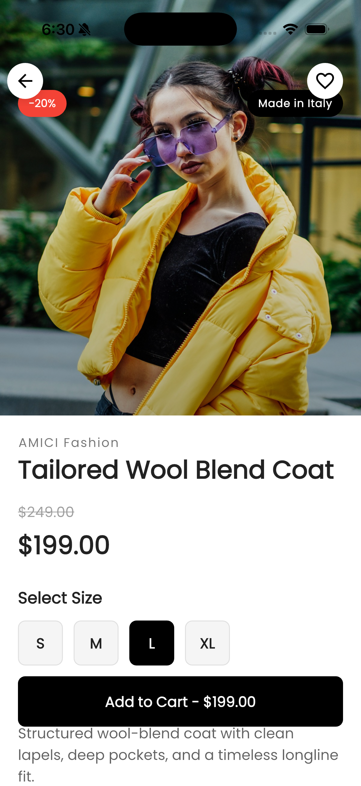
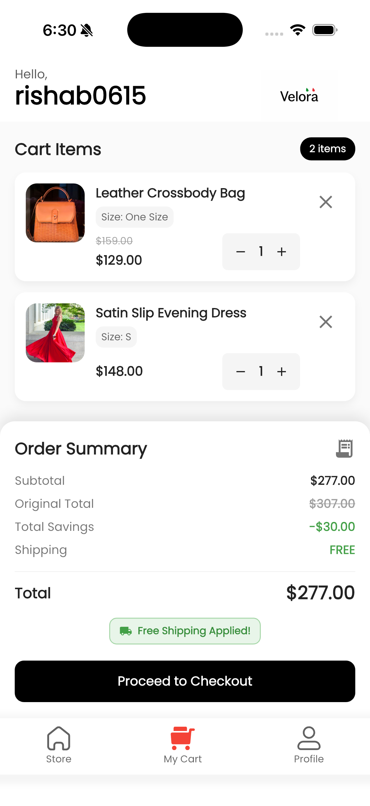
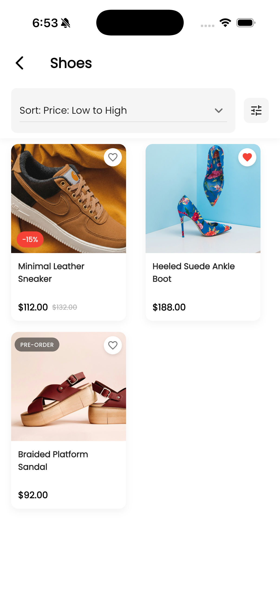

# 🛍️ Velora Fashion App (Flutter)

A modern and premium fashion ecommerce application built using Flutter.

Velora focuses on clean UI/UX, scalable architecture, reusable components, and a smooth shopping experience inspired by modern ecommerce platforms.

---

## ✨ Features

* 🔐 Firebase Authentication
* 👤 User Profile Management
* 🛒 Shopping Cart System
* ❤️ Wishlist Functionality
* 📦 Order Placement Flow
* 📜 Order History Screen
* 🏷 Product Categories
* 🔍 Product Details Page
* 📱 Responsive UI Design
* ⚡ GetX State Management
* 🎨 Reusable Components & Centralized Theme
* ☁ Firebase Backend Integration

---

## 📸 Screenshots

<p align="center">
    

  
  
</p>

<p align="center">

  
  
</p>

---

## 🛠 Tech Stack

* Flutter
* Dart
* GetX (State Management)
* Firebase Authentication
* Cloud Firestore
* Clean Architecture

---

## 📂 Project Structure

```plaintext
lib/
├── app/
│   ├── data/
│   │   ├── models/
│   │   ├── services/
│   │   └── controllers/
│   ├── modules/
│   │   ├── auth/
│   │   ├── home/
│   │   ├── product/
│   │   ├── cart/
│   │   ├── checkout/
│   │   ├── orders/
│   │   └── profile/
│   ├── routes/
│   ├── theme/
│   ├── utils/
│   └── widgets/
```

---

## 🚀 About This Project

Velora was built to simulate a modern ecommerce shopping experience with clean architecture and scalable Flutter practices.

The main goals of this project were:

* Build a production-style ecommerce UI
* Practice scalable Flutter architecture
* Create reusable and maintainable widgets
* Implement complete shopping flow
* Integrate Firebase Authentication & Firestore
* Focus on polished UI/UX design

---

## 🎯 Key Highlights

* Fully functional shopping flow
* Clean and modern interface
* Scalable project structure
* Firebase integration
* Modular architecture using GetX
* Reusable UI components
* Responsive layouts for multiple devices

---

## 👨‍💻 Author

**Rishab Sharma**

Flutter Developer

---

## ⭐ Note

This project was built for learning, portfolio showcase, and frontend architecture practice.

Some product data/images may use mock/demo content for UI demonstration purposes.
